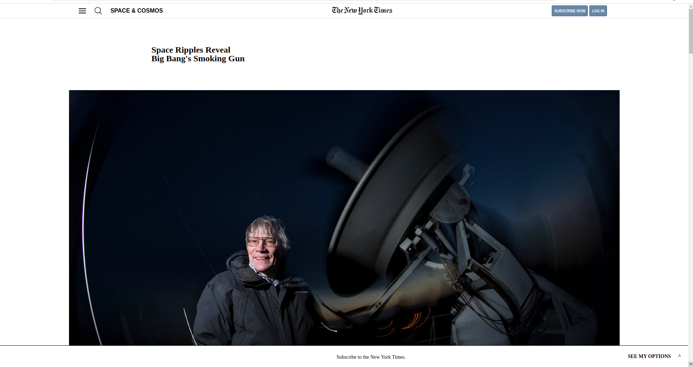

# New York Times Article Page

> This is a project that clones the New York Time Website.
> The purpose of this project is to practice with positioning and floating. 

## Built With

- HTML
- CSS
- Linters
- Stickler
- VSCode
- Notepad++

## Live Demo

[Live Demo Link](https://euqueme.github.io/new-york-times-clone/)

## Automated Test

> there are no automated tests for this project yet

## Author

👤 **María Eugenia Quemé**

- Github: [@euqueme](https://github.com/euqueme)
- Linkedin: [María Eguenia Quemé Peña](https://www.linkedin.com/in/maria-queme/)

👤 **María Reyes**

- Github: [@majovanilla](https://github.com/majovanilla)
- Linkedin: [María José Reyes Parroquin](https://www.linkedin.com/in/majoreyesparroquin/)

## 🤝 Contributing

Contributions, issues and feature requests are welcome!

Feel free to check the [issues page](https://github.com/euqueme/youtube-page/issues).

## Show your support

Give a ⭐️ if you like this project!

## Acknowledgments

You can check the original version [here](https://www.nytimes.com/2014/03/18/science/space/detection-of-waves-in-space-buttresses-landmark-theory-of-big-bang.html?_r=0)

This project is part of the [Microverse Curriculum.](www.microverse.org)

This project is part of the Odin Project Curriculum ["PROJECT: POSITIONING AND FLOATING ELEMENTS"](https://www.theodinproject.com/courses/html5-and-css3/lessons/positioning-and-floating-elements)

## 📝 License

MIT
